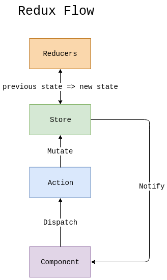
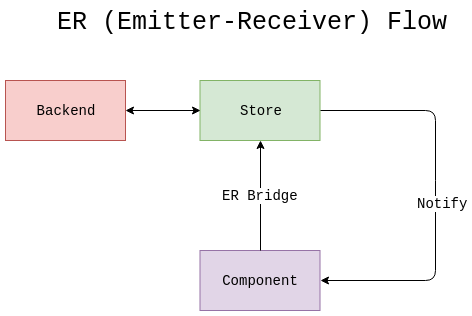

<p align="center">
    
</p>

---

> ER is a new pattern that let's you feel free from actions

This package allows you to get rid of actions. You can use decorators to register actions directly in your state, you don't have to create any actions in your project (until you really need them), as they don't give any profit, only bring extra boilerplate files.

## Concepts



We've simplified this flow and threw out unnecessary mediators:



## :package: Install

To install `@ngxs-contrib/emitter` run the following command:

```console
npm install @ngxs-contrib/emitter
# or if you use yarn
yarn add @ngxs-contrib/emitter
```

## :hammer: Usage

Import the module into your root application module:

```typescript
import { NgModule } from '@angular/core';
import { NgxsEmitPluginModule } from '@ngxs-contrib/emitter';

@NgModule({
    imports: [
        ...,
        NgxsEmitPluginModule.forRoot()
    ]
})
export class AppModule {}
```

## Receiver

Receiver is a basic building block. `@Receiver()` is a function that allows you to decorate static methods in your states for further passing this method to the emitter:

```typescript
import { State, StateContext } from '@ngxs/store';
import { Receiver, EmitterAction } from '@ngxs-contrib/emitter';

export interface CounterStateModel {
    value: number;
}

@State<CounterStateModel>({
    name: 'counter',
    defaults: {
        value: 0
    }
})
export class CounterState {
    @Receiver()
    public static setValue({ setState }: StateContext<CounterStateModel>, { payload }: EmitterAction<number>) {
        setState({
            value: payload
        });
    }
}
```

## Emitter

Emitter is basically a bridge between your component and receivers. `@Emitter()` is a function that decorates properties defining new getter and gives you an access to the emittable interface:

```typescript
import { Select } from '@ngxs/store';
import { Emitter, Emittable } from '@ngxs-contrib/emitter';

import { CounterStateModel, CounterState } from './counter.state';

@Component({
    selector: 'app-counter',
    template: `
        <ng-container *ngIf="count$ | async as count">
            <h3>Count is {{ count.value }}</h3>
            <div class="add-counter">
                <button (click)="counterValue.emit(count.value + 1)">Increment (+1)</button>
                <button (click)="counterValue.emit(count.value - 1)">Decrement (-1)</button>
            </div>
        </ng-container>  
    `
})
export class CounterComponent {
    @Select((state) => state.counter)
    public count$: Observable<CounterStateModel>;

    // Use in components to emit asynchronously payload
    @Emitter(CounterState.setValue)
    public counterValue: Emittable<number>;
}
```

## Custom types

You can define custom type for debbuing purposes (works with `@ngxs/logger-plugin`)

```typescript
import { State, StateContext } from '@ngxs/store';
import { Receiver } from '@ngxs-contrib/emitter';

@State<number>({
    name: 'counter',
    defaults: 0
})
export class CounterState {
    @Receiver({
        type: '[Counter] Increment value'
    })
    public static increment({ setState, getState }: StateContext<number>) {
        setState(getState() + 1);
    }

    @Receiver({
        type: '[Counter] Decrement value'
    })
    public static decrement({ setState, getState }: StateContext<number>) {
        setState(getState() - 1);
    }
}
```

## Actions

If you still need actions - it is possible to pass an action as an argument into `@Receiver()` decorator:

```typescript
import { State, StateContext } from '@ngxs/store';
import { Receiver } from '@ngxs-contrib/emitter';

export class Increment {
    public static type = '[Counter] Increment value';
}

export class Decrement {
    public static type = '[Counter] Decrement value';
}

@State<number>({
    name: 'counter',
    defaults: 0
})
export class CounterState {
    @Receiver({
        action: Increment
    })
    public static increment({ setState, getState }: StateContext<number>) {
        setState(getState() + 1);
    }

    @Receiver({
        action: Decrement
    })
    public static decrement({ setState, getState }: StateContext<number>) {
        setState(getState() - 1);
    }
}
```

## Dependency injection

Assume you have to make some API request and load some data from your server, it is very easy to use services with static methods, Angular provides an `Injector` class for getting instances by reference:

```typescript
import { Injector } from '@angular/core';

import { State, StateContext } from '@ngxs/store';
import { Receiver } from '@ngxs-contrib/emitter';

interface Todo {
    userId: number;
    id: number;
    title: string;
    completed: boolean;
}

@State<Todo[]>({
    name: 'counter',
    defaults: []
})
export class TodosState {
    // ApiService is a class that is defined somewhere...
    public static api: ApiService;

    constructor(injector: Injector) {
        TodosState.api = injector.get<ApiService>(ApiService);
    }

    @Receiver()
    public static getTodos({ setState }: StateContext<Todo[]>) {
        // If `ApiService.prototype.getTodos` returns an Observable - just use `tap` operator
        return this.api.getTodos().pipe(
            tap((todos) => setState(todos))
        );

        // If `ApiService.prototype.getTodos` returns a Promise - just use `then`
        return this.api.getTodos().then((todos) => setState(todos));
    }
}
```
